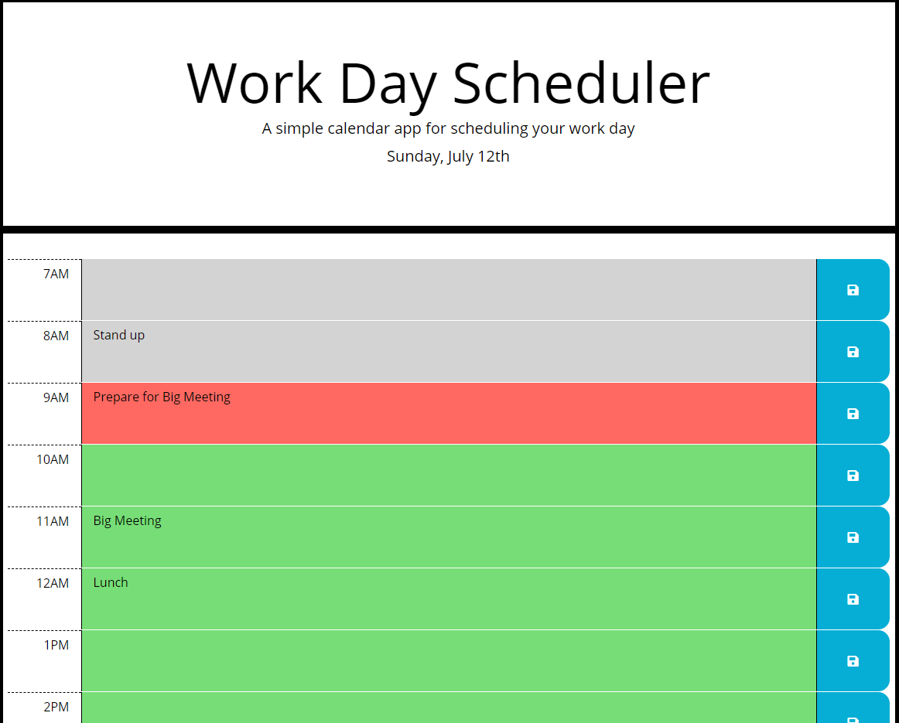

# WorkdayScheduler
Work day planer using jQuery, the JS Moment library, Bootstrap 4, fontawesome icons, and local storage to allow the user to schedule appointments.

### Sample Schedule, 9AM

https://jodoedjr.github.io/WorkdayScheduler/